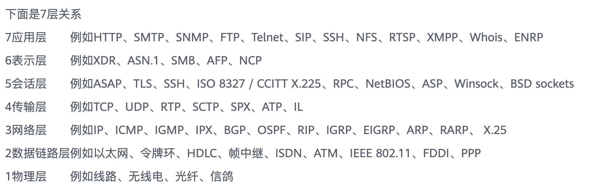

# Btyedance

### HTTP 和 HTTPS

#### HTTP

- Hyper Text Transfer Protocol（超文本传输协议）
- 客户端浏览器和 web 服务器之间的应用层通信协议
- 所有的 www 文件都必须遵循这个标准

#### TCP 和 IP

- tcp 和 udp 协议是在传输层，，web 以 http 协议作为应用层，以封装 HTTP 文本信息，然后使用 TCP/IP 作为传输层协议将他们发到网络上
- 7 层关系
- TCP 和 UDP 就像卡车，IP 就像高速公路，HTTP 就像卡车携带的货物
- 从下至上来看，物理层-> 数据链路层-> 网络层-> 传输层-> 会话层-> 表示层-> 应用层

#### SSL 和 TSL

- SSL：（Secure Sockets Layer 安全嵌套层），SSL 协议分为两层： SSL 记录协议（SSL record protocol），它建立在可靠的传输协议上，例如 TCP，为高层协议提供数据封装，压缩，加密等基本功能的支持； SSL 握手协议（SSL handleshake protocol），它建立在 SSL 记录协议上，用于实际的传输前，通讯双方进行身份认证，协商加密，交换密钥等
- TSL：SSL 的继任者传输层安全（Transport Layer Security）：为网络通信提供安全及数据完整性的安全协议，以及检验客户端和服务器是否安全。
- TSL 和 SSL 在传输层对 网络进行加密，SSL 在应用层和 TCP 层之间，应用层不再直接传输给传输层，而是传递给 SSL 层，SSL 层从应用层收到的数据进行加密，并增加自己的 SSL 头

#### HTTPS

- Hyper Text Transfor Protocol over Sercure Socket Layer（以目的为安全的 HTTP 通道），即 HTTP 的安全版，即 HTTP 加入了 SSL 层，HTTPS 的安全基础是 SSL，因此加密的信息就需要 SSL

##### HTTPS 和 HTTP 区别

- HTTP 协议是以明文方式发送内容，不提供任何方式的数据加密。HTTPS 在 HTTP 协议的基础上，加入了 SSL 协议，SSL 依靠证书来验证服务的身份，并为浏览器和服务器之间的通信加密。
- HTTPS 的主要作用：
  - 对数据进行加密，并建立一条信息安全通道，来保证传输过程中的数据安全
  - 对网站服务器进行真实身份识别
- HTTPS 和 HTTP 主要区别
  - HTTPS 需要到 ca 申请证书，一般免费证书很少
  - HTTP 是超文本传输协议，是明文传输。HTTPS 则是具有安全性的 SSL 加密传输协议
  - HTTP 和 HTTPS 使用的链接方式不同，HTTP 常用的是 80 端口，HTTPS 为 443

### 如何解决跨域

#### 什么是跨域： 一个域下的脚本或文档想去访问另一个域的资源，这里的跨域是广义的。

#### 什么是广义的跨域

- 资源跳转（a 链接，重定向，表单提交）
- 资源嵌入（< link>,< iframe>< script>,background: url 之类的文件外链）
- 脚本请求：js 发起的 ajax 请求，dom 和 js 的跨域操作等
- 其实我们所说的跨域都是狭义下的跨域，是由浏览器同源策略下限制的一类请求

#### 同源策略（SOP same origin policy）

- 是一种约定：指协议+域名+端口三者相同，即使两个不同的域名指向同一个 ip 地址，也不是同源。它是浏览器最核心也是最基本的安全功能，如果缺少同源策略，浏览器很容易受到 XSS，CSFR 的攻击。
- 同源策略限制后的几种行为
  - localStorage,cooike,indexDB 无法获取
  - DOM 和 js 对象无法获取
  - AJAX 请求无法发送

#### 常见的跨域场景
```
URL                                      说明                    是否允许通信
http://www.domain.com/a.js
http://www.domain.com/b.js         同一域名，不同文件或路径           允许
http://www.domain.com/lab/c.js

http://www.domain.com:8000/a.js
http://www.domain.com/b.js         同一域名，不同端口                不允许
 
http://www.domain.com/a.js
https://www.domain.com/b.js        同一域名，不同协议                不允许
 
http://www.domain.com/a.js
http://192.168.4.12/b.js           域名和域名对应相同ip              不允许
 
http://www.domain.com/a.js
http://x.domain.com/b.js           主域相同，子域不同                不允许
http://domain.com/c.js
 
http://www.domain1.com/a.js
http://www.domain2.com/b.js        不同域名                         不允许
```

#### 常见的跨域解决方案

- 1.JSONP 跨域：

  - 原理：通常为了减轻 web 服务器的负载压力，我们将 js，img，css 等静态资源分离到另一台独立域名的服务器上，在 html 页面中再通过相应的标签从不同的域名加载静态资源，而被浏览器允许，基于此原理，我们可以动态创建 script，再请求一个带参网址实现跨域。
  - 原生实现：

    - 前端

    ```
    <script>
    var script = document.createElement('script');
    script.type = 'text/javascript';

    // 传参一个回调函数名给后端，方便后端返回时执行这个在前端定义的回调函数
    script.src = 'http://www.domain2.com:8080/login?user=admin&callback=handleCallback';
    document.head.appendChild(script);

    // 回调执行函数
    function handleCallback(res) {
        alert(JSON.stringify(res));
    }
    </script>
    ```

    - 服务端返回如下（返回时即执行全局函数）：

    ```
    handleCallback({"status": true, "user": "admin"})
    ```
