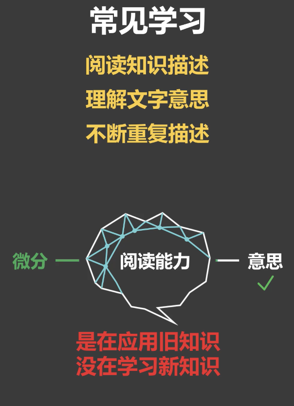
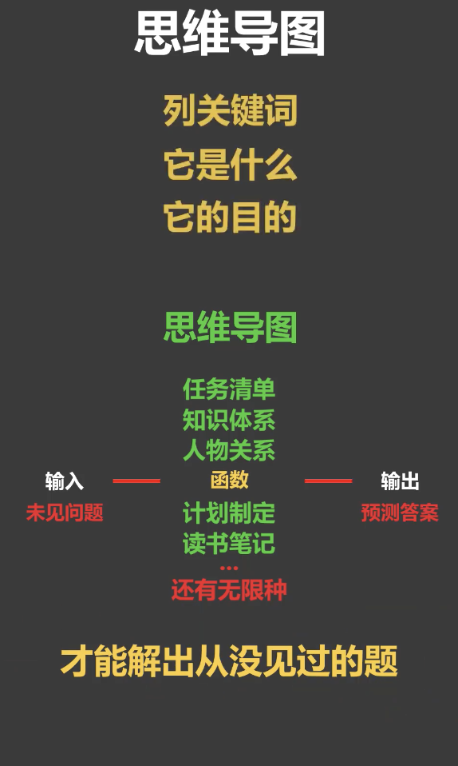
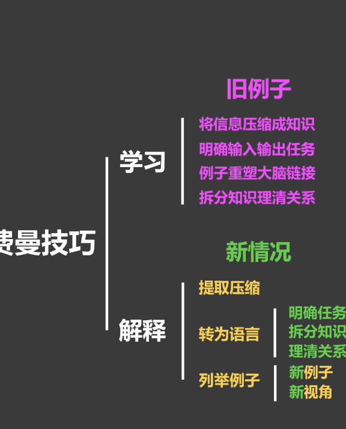
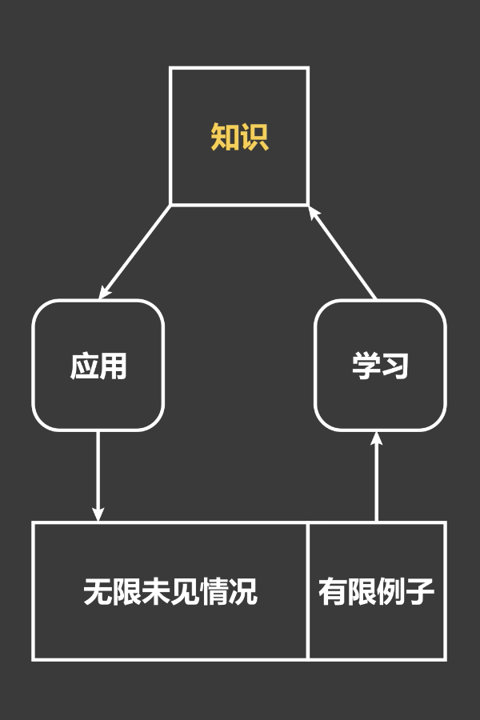
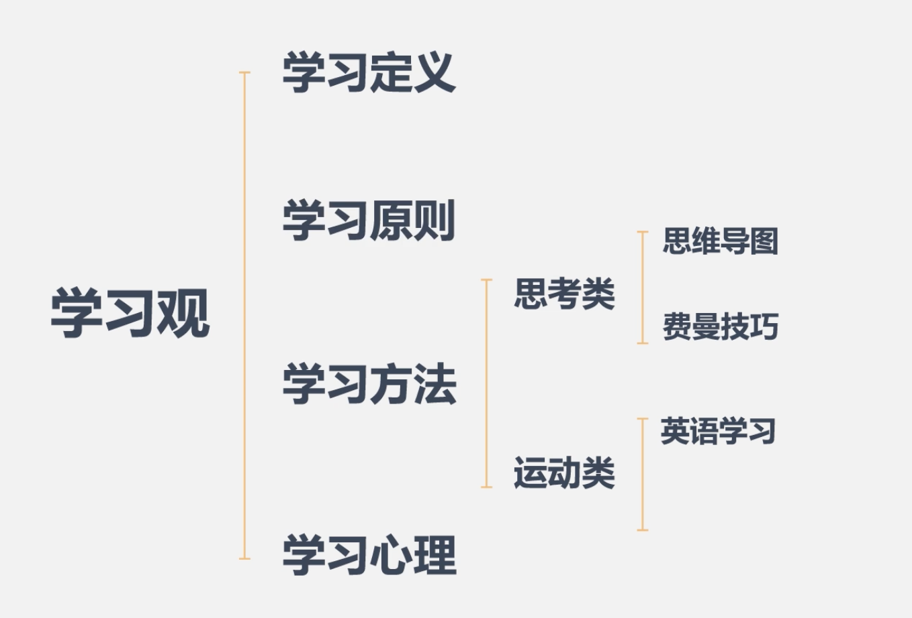
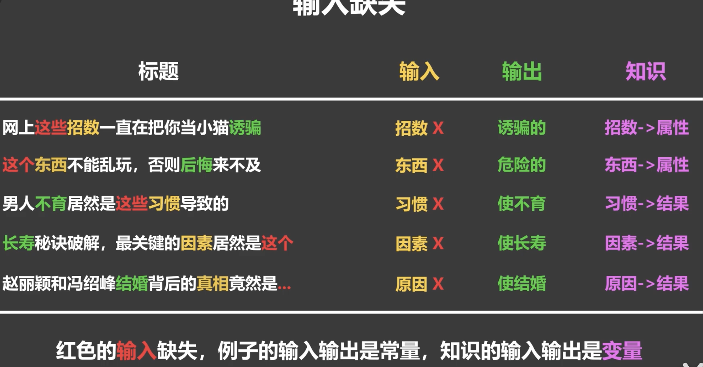
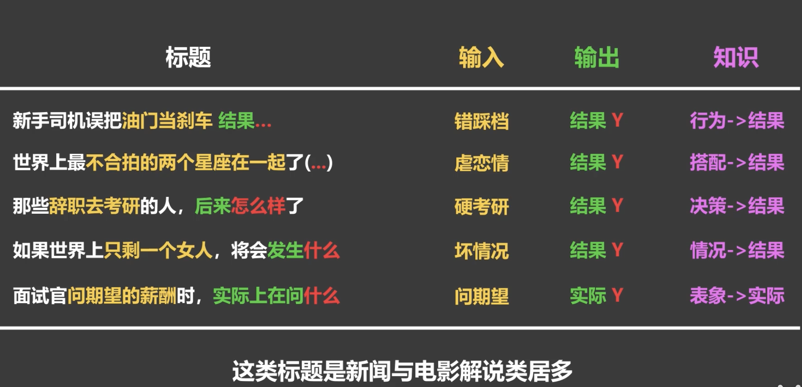
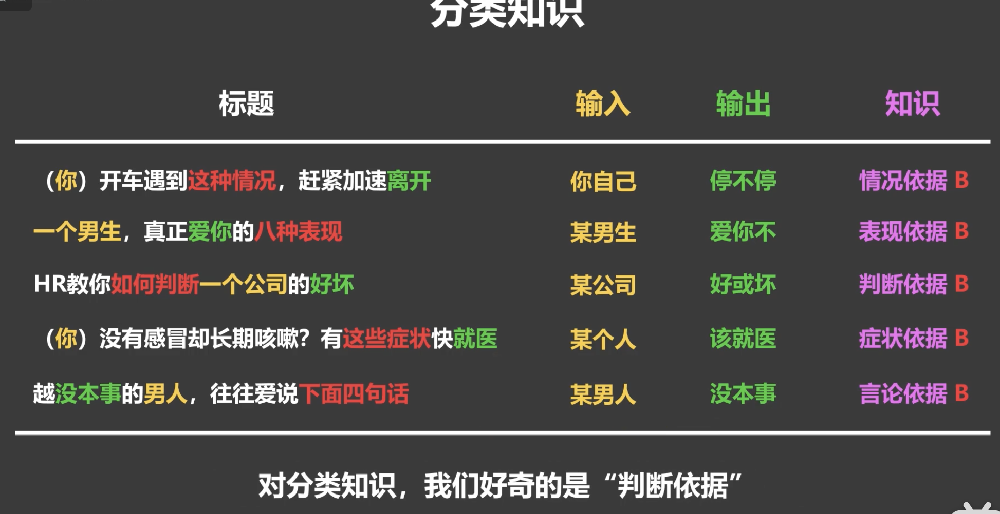
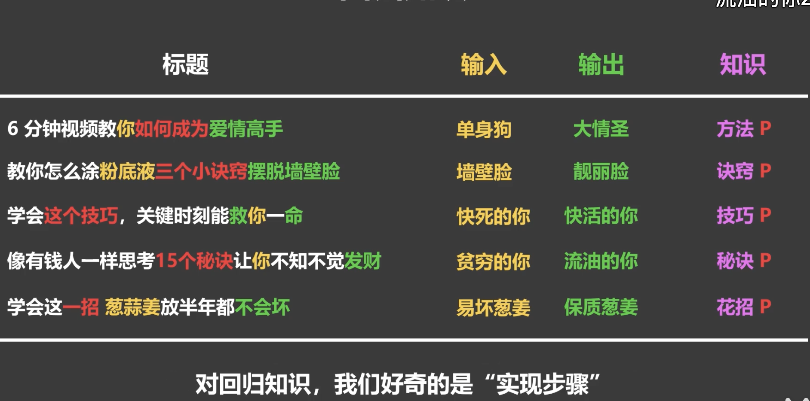

# How We Learn

### 1.什么是学习

  #### 学习： 在有限的例子中，找出问题和答案之间规律的过程
  #### 知识： 所找出来的规律就是知识。
  + 如果你没有办法描述你的知识，那你就没有真正学会它，因为学习就是在用知识压缩原本无限的信息
  
### 2.把书读薄
  #### 学习的第一步： 明白什么是问题，什么是问题的答案。 有些人压根不知道什么是问题的答案，只记住了知识的描述。 然而知识不是信息，学习不是记忆，这也是人们在教与学的过程常遇到的问题，以为把知识告诉了某人，对方就就可以学会，然而知识的描述只是对学习起到了引导的作用，最终的学习一定要通过例子理清问题和答案的关系来重塑大脑链接。这也是为什么讨论，写文章会伴随着例子，而不是单纯的对知识进行描述。由于学习是为了解决新问题，所以需要验证现有例子所提炼的知识，是否能描述问题和答案之间的规律，而不是仅仅记住了这些现有的例子

### 3.英文如何学：
学习最重要的两步明确问题，输入和答案输出，用例子构建知识学习方式分为两大类，运动类（语言，运动）和思考类（数学，逻辑）。
区别在于是否依靠意识，因为意识是后进化出来的，擅长解决的是推断问题，但速度缓慢。学不会的原因都出在错误的输入、输出，错误的学习方式，用思考类方式来学习所有知识，比如看书学游泳，不通过例子仅记忆知识。
以语言为例四项能力的正确输入、输出、类型分别是（听声音-说想法-读文字-写想法），应试英语的普遍误区是输入、输出变成了完形填空，阅读选择等。这类从一些文字到到另一些文字做思考类问题，用百词斩背单词还容易产生另一种偏差输入输出变成了图片到中文，英语学习中作为致命的是插入的中文思考这个中间输出不仅输出错误，而且非常缓慢会让很多种懂外语但未经训练的人同时翻译中文的话，他们会反应不过来就是因为他们的大脑在这个过程中其实并不思考中文，当出国后就会发现所学英语的输入和真实英语的输入是不同的，根本用不了。不通过例子仅记忆知识也是特别常见的错误由于语言的由于语言的输入从来就不是一个单词，而是一个句子.要想把握句子中某个单词的真正含义.需要通过体会大量不同的列句，但多数时候，学生仅仅是记住了单词的中文描述，很多英语名师也都犯一样的错误，不管他们总结的再好，若仅仅是把他的总结告诉学生，学生永远都是把他的总结当成信息记忆，而不是作为知识学习。学不会英语，是因为搞错了输入输出。造成学到的是完全不同的知识。

### 4.思维导图原理：人生与高手之差

#### 学习流程

#### 常规学习

#### 思维导图的学习模式

### 5.如何设计思维导图
+ 1.依据是如何满足这四个要素：明确输入输出任务；将信息压缩成知识；例子重塑大脑链接；二阶知识拆开知识。
  + 步骤：  
    + 1.搜集例子（可以把搜集例子按渠道拆分为脑中现有的和借助外力的）
    + 2.自我提问（问列出的关键词是什么，例如问思维导图是什么，这实际上是在学习分类，输入是一个事物，输出是它是否是一个思维导图，可以上网搜素到无数个例子，无法穷举所有的情况，所以需要找出这些例子的共性，也就是第二条，找出规律，将信息压缩成知识，我会不断的问为什么这个例子是思维导图，也就是在寻找分类的边界，边界就是把杂乱信息拆开成知识网络的工具，这个过程是学习判断一个事物是不是思维导图的知识，但我的目的是为了以后能够自己画出任何情况的思维导图，包括我从来没见过的，这时我的输入输出就不一样了，输入是杂乱信息，输出是知识网络，要学习的知识是输入是如何变成输出的，这就是要明确学习的规律是什么问它是什么，为什么是，是分类的自我提问问它的目的，如何达到，是回归的自我提问。拆分任务也是自我提问，问的是子知识和子知识的关系，拆分成组合关系时，会问它有什么，拆开成执行步骤时，会问先后顺序还有条件循环，这个自我提问便是循环，而循环的停止条件就是将大知识拆分成自己已知的知识为止）

### 6.费曼技巧

#### 1.方法只不过是达成目的的手段，手段可以选择，目的才是核心，费曼技巧只有两步，一是学习，二是解释。 学习时通过四步法则： 
+ 1. 将信息压缩成知识
+ 2. 明确输入输出的任务
+ 3. 例子重塑大脑链接
+ 4. 拆分知识理清关系
#### 2.解释需要使用新的例子来验证

#### 3.学习是用有限的例子来压缩信息，所压缩的信息包括从未见过的情况，因为我们正是要用知识要解决从未见过的问题。对于已见过的问题，直接上网搜索即可，然而记住某些内容只能重述某些内容，但却无法解释新情况。与学习时不同，解释时所用的例子不再是学习时的例子，而是对方面对情况的输入输出，要帮对方来理清关系，如果对方无法理解，则需要举新的例子，若还无法理解，则需要换新的视角。这些都是你在当初学习时从未遇到过的情况，而当你可以产生并解释这些新的情况时 ，也就验证了你的学习。思维导图是以过程为主导的学习方法，而核心在于拆分知识，而费曼技巧是以目的为导向的学习方法，核心在于验证知识，但费曼技巧早在两年前就写在了孔子论语中：“温故而知新，可以为师矣”，这里的故就是旧的知识，新就是从未见过的情况，当可以从有限的例子中提取知识来解释新情况时，就意味着你真正的学会了它，便可将知识教授给别人。

### 7.运动类学习

#### 语言就和运动一样，我们可以理解老师说的一切，但如果不练习就说不了。像运动，乐器之类的知识叫做隐形知识，对于这种知识，只需两个原则。首先定义直接的输入和输出。英语能力有四种，听说读写，所以你需要决定加强哪一种的能力，然后通过不同的例子去创建大脑之间的链接，每个例子是输入与对应输出的配对。对于听力，我们常见的错误就是读字幕，因为如何你在听的过程中看字幕，你将学到一个不同的知识，它的输入是声音和字幕的组合，当字幕消失就用不了了，这正是因为错误输入造成的误区。因错误输出造成的误区是只听声音，但却不知道意思，也就是说，你压根就没有对应输出，不管多么努力练习将一无所获。多数人感兴趣的是如何从0开始学英语，健身时我们有不同的阶段，英语也有自己的阶段。
#### 人们有一个做梦都无法想到的误区，那就是单词不靠记忆，而靠学习，英语有四种能力，需要构建听说读写4种知识，没有一个知识的输入是只有一种情况的。而进化出的遗忘是对学习非常中重要的一种机制，它防止了人们像计算机以一样记住个别情况，增加普遍性，百年来人们都想让计算机像人脑一样学习，而我们却反而让自己像计算机一样去记忆，不断的去记忆单词，遗忘机制又不断的防止我们去记忆单词，我们一直都在错用自己的大脑，彻彻底底的南辕北辙。
#### 如何学习英语呢： 明确输入输出，使用例子重塑大脑链接，因为你可以根据原则设计出无数个方法。首先是选择一个陌生单词，看他的英文解释，然后看多个例句来抓住意思，从中选择一个例句，尽量选择简单而不是长难句，看句子不思考中文的场景下，想象句子所描述的场景，看句子，想场景，重复两三次。这是在阅读输入是图片，输出是意思，注意不要读出来，这是很多人阅读慢的原因，因为涉及了读出来这个中间过程，变成了图片到声音再到意思的过程，以后会造成不读出来就看不懂了，然后重复想象你要表达这种场景，再实际打出消息发给某人，这是在学习打字；输入是特定意思的表达欲望，输出是手部动作，再把句子输入到翻译网站上，边听这段英语，边想象场景，这是在学习听力；接着想象你要表达这种场景，说出这个句子，这是在练习口语。最后改几个单词，再把上面的过程重复一遍，只需要能认识和表达这个句子即可。
#### 学习时需要注意几点：
+ 1. 不要依靠意识： 在听说读写之前你可以靠意识决定接下来做什么，但在做的过程中，不要思考，更不能思考中文，就像你在练习舞蹈动作一样，不需要思考每个动作是如何拼接在一起的，更不会把每个动作翻译成中文句子，可以先靠中文来确定意思，但随后一定要只想象场景，你会好奇为什么不要思考，因为后进化出来的意识能够解决的是单一因素且对速度没有过多要求的知识，但像声音这种有音调，噪音众多因素，且对速度有要求是远远超过了意识的能力范围，想象你在玩游戏时，游戏规则非常复杂，然而你却可以很快的学会，但如果游戏操控的方向突然颠倒，虽然只需要加一个简单的反向规则即可，但你的大脑还是无法反应过来的，正是因为这个过程不涉及思考
+ 2. 以句子为单位：同一个单词会在不同的句子中有不用的意思，因此语言的输入不是单词，而是句子
+ 3. 多例子学习：我们知道重复很关键，但最关键是的不同例子的重复，因为一个例子只能对大脑重塑起一种作用，重复可以加强这种作用。但需要很多个例子的共同作用才能学会这个知识，所以才会要求改单词造句再来一遍，而不是一个句子无限重复
+ 4. 输出要一致：对于运动类的知识，学习方法非常单一，只需要确定正确的输入输出，靠大量的例子来重塑大脑链接即可，但最重要但一点就是，同一个输入但输出要一致。
### 8 为什么人类无法感知真实的世界（感知和真实）
  + 问题的关键在于任何生物都无法获取所有信息，我们得到的信息都是有限的，因此我们需要模型来预测所发生的事件，而魔术正是利用了认知模型的预测和真实事件之间的差异而带给人们冲击。一切的冲突都源于观念的不同，也就是产生观念的模型之间的不同，因此几乎所有电影描述的都是模型之间的冲突，贴近生活来说，情侣之间的冲突，对同一件事男生觉得没什么， 女生会觉得没法过，而双方都希望彼此能够理解自己。高管会觉得员工不考虑公司发展，而员工会觉得高管不理会个人利益。
  + 意识到感知不是真实，感知源于模型后的人们很容易陷入极端，比如认为世间是丑陋的，应忏悔回归宗教信仰达成自我救赎。又如开始追求更普遍的真理而最终得出一切都是虚无的结论拒绝一切社会规则，可问题的关键不在于怎么做，而在于为什么会这样，难道是因为我们根本没有能力来感知真实才不得不依赖这些模型而存活，才不得不竭力袒护自己的模型，大脑追求的根本不是真理而是让我依赖和坚信的模型，难道大脑真的感知不到我们与其他生物感知不同吗？
  真的注意不到眼镜可以将我们的视力调节成无数种形态吗？是主动选择忽略了这些内容，因为感知真实无法保证我们的存活，如果不相信自己的模型，就无法做出决策，从而无法生存。虽然模型感知到的不是真实，但却是我们赖以生存的唯一工具
  + 回到最初的问题，为什么要学习。学习正是为了构建这些模型从而让我们更好的看清世界，更好在自己所处的环境中生存，然而学习观只告诉了我们如何构建模型，却没有告诉我们如何选择和对待已有的模型，对于感知层面你不用担心，因为目前我们没有选择权，感知模型主要由自然选择所控制。对于认知层面，多数人信封科学，虽然科学也不能感知真实，但科学却有唯一的评估标准，那就是与观测不一致的模型都会舍弃，因此可以依赖也不会出现太多的选择问题，但对观念层面我们却没有唯一评估的标准，这里的模型是无法依靠科学来选择的，因此高等科学教育并不能保证人品。另一方面由于我们一半以上的生理特性都是服务于模型的构建，而这些特性也会被他人来塑造你的观念，知道一些生理特性可以让你看清身边这些观念植入的行为，也让你认识自我主动利用这些新特性来学习新知识，因此要分享就是如何判断模型的好坏以及人类构建模型所演化出来的生理特性，因为你的所有价值，原则，决策都来源模型，谁塑造你的模型谁就塑造了你，关键在于这人是你还是他人。

#### 9 建模欲望
 + 正如我们会使用食物引诱动物一样，网络也一直在用人性引诱大众，权利，情色，金钱等这类引诱，我们早已习以为常。可为什么我们对有些并非这类低俗引诱的内容仍然难以抗拒，这到底使用了人类的哪个生理模型。这个生理模型就是最让人忽视的好奇心，人们现在都意识到好奇心的重要性，但却发现，随着年龄的增长，好奇心会慢慢消退，不仅如此，学习能力也不如以前。于是人们得出一个结论，好奇心和学历能力会随着年龄的增长而下降，很多人也会因此觉得自己已经来不及学习了，这辈子就认命了，这是多数人对好奇心的认识，然而这个认识安全错了。不管年龄是否和好奇心相关，都是随着时间而增长，无法认为年龄就是影响好奇心的因素。
 + 事实上，好奇心和食欲，性欲一样，是人类的基本欲望。和好奇心相关的大脑区域就是负责奖励机制的伏膈核，也正是对成瘾行为起重要作用的区域，因为我们不得不依赖自己的模型而存活，所以一定会想尽方法的去建立模型（学习），而好奇心便是演化出来促进学习的奖励机制，每个人生下来就是一部终身好奇的学习机器，但却和我们的普遍认知不符，因为很多家长费劲了“脑汁”也无法让孩子喜欢学习，有些人也觉得自己根本不爱学习，怎么能说好奇心和食欲一样是人类的基本欲望呢。事实上，我们不是不喜欢学习，而是不喜欢不符合大脑特点的记忆，当我们对食物饥饿时，大脑会产生食欲，会无法抑制想要进食。学习和进食一样，当我们对知识饥饿时，大脑会产生求知欲，也会无法抑制想要学习，但多数人的学习并不是这样的。他只是知道学习，却没有产生过好奇心，最终变成了自己强迫去记忆知识，又怎么可能会喜欢呢。既然好奇心是促进学习的关键，那么如何调动自己的好奇心呢，回答这个问题首先要搞清楚的就是我们对什么好奇。
 + 好奇心的目的是为了构建知识，让我们可以适应当前环境，得以生存，因此我们对知识好奇，然而最为关键的一点，我们无法通过记忆知识来学习知识，只有通过归纳例子来构建知识，因此我们更为好奇的内容其实是例子，而在生活中的例子正是故事。这解释了我们为何如此喜欢故事，为什么大多数的演讲都是从一个故事作为开始，为什么春秋战国时期的纵横家都是以讲故事的方式来游说君主，因为一个故事可以瞬间让大脑清楚知识的输入和输出，而例子是从输入到输出的一个具体变换，缺一不可，所以当只有输入或输出时，好奇心会使我们的大脑急切的想要知道另一个帮助自己搜集完整的例子
  
 + 现在我们来回答网络标题是如何利用好奇心来引诱大众的，大致可分为例子残缺和知识白送两大类，例子残缺的特点就是只给你输入或输出，但绝不完整的提供二者， 让你的好奇心点击内容。
 + 输入缺失
  
+ 输出缺失
  

 + 而白送的知识分为两种，正是回归知识（程序性知识）和分类知识（陈述性知识），对分类知识我们好奇的是判断依据，对回归知识我们好奇的是如何做到
   + 分类知识

  
   + 回归知识

+ 从上面的例子发现，只要产生了好奇心，都难以抵挡这种诱惑，也就是没有一个人是不喜欢学习的，所以家长在教育孩子的时候请不要对他的好奇心不耐烦，因为我们当代的教育系统已经是好奇心的最强杀手了，然而我们最为感兴趣的如何将好奇心应用到我们的日常学习中，正是画思维导图时的自我提问，思维导图是用来拆开要学习的新知识，每次我们都需要重新考虑新知识和子知识之间的关系，那些自我提问不仅可以帮助我们拆开知识，更会调动我们的好奇心来促进我们的学习。但知道了如何应用好奇心后还有一个关键问题每天有回答，那就是为什么随着年年龄的增长好新奇会下降呢，实际上阻碍我们好奇心根本不是年龄，恰恰是我们已有的知识，因为模型对我们非常重要，我们依赖模型而活，因此不仅进化了构建模型的好奇心，同时也进化出了用了保护已有模型的固执心，倘若什么都信，那就会像个受骗老人一样把钱财交出去，而固执心有两个常见的表现，拒绝新知识，看到新知识后，会说服自己，说这个没用，然后心安理得的不学习它。另一个表现就是将新知识归为旧的知识，看到新知识会说，这不就是那个啥吗，我学过，我知道，然后忽略了细小差异。固执心是进化出来的保护机制，没有什么不对，这样反而不容易陷入知识恐慌，但你又让自己有创造力，就唯有保持初学者那种一无所知的心态，才会激起好奇心，才会保持对知识的饥饿，这正是乔布斯留给新生的stay hungry， stay foolish，除了固执心以外，好奇心还有一个敌人，是权威思维。这种思维是不独立思考，只相信权威，认为任何问题都有一个官方的，唯一的知识，看到新知识后，就相信一定有本教科书罗列了所有内容，这是当代教育环境最让人们形成的一种学生思维，只要加上科学二字就无条件相信，当意识到自己被骗后，就得出了科学不可相信的结论，但上面的科学指的是该人通过网络所形成的对科学的认识，而真正的科学是对知识不断验证和更新的一个过程，地心说在当时可以满足所有的观测，是最科学的知识，而观测到更多数据后，科学又将知识更新为了日心说，但当发现太阳也不是宇宙中心后，就再次更新了知识。正是科学这种验证为标准，又不断完善的精神才被人们所推崇，当下的知识在未来一定会被更新，根本教不完，所以更重要的是如何学习知识，判断知识。
+ 我们再来说说洗脑， 2

