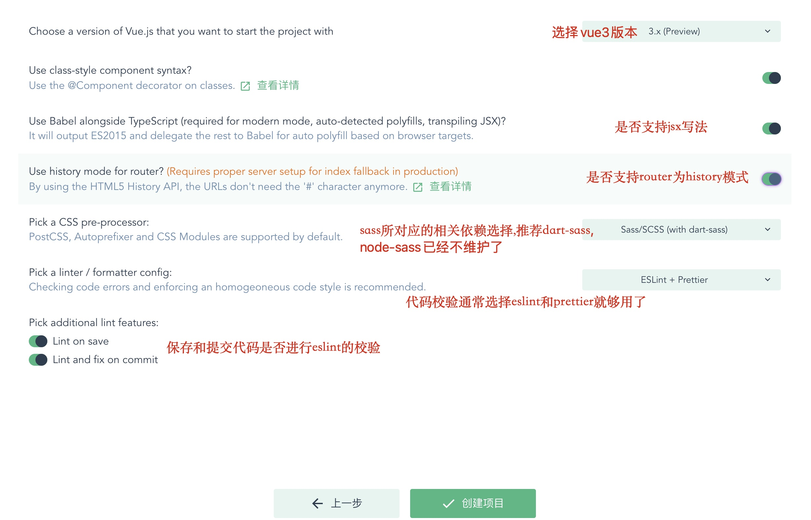
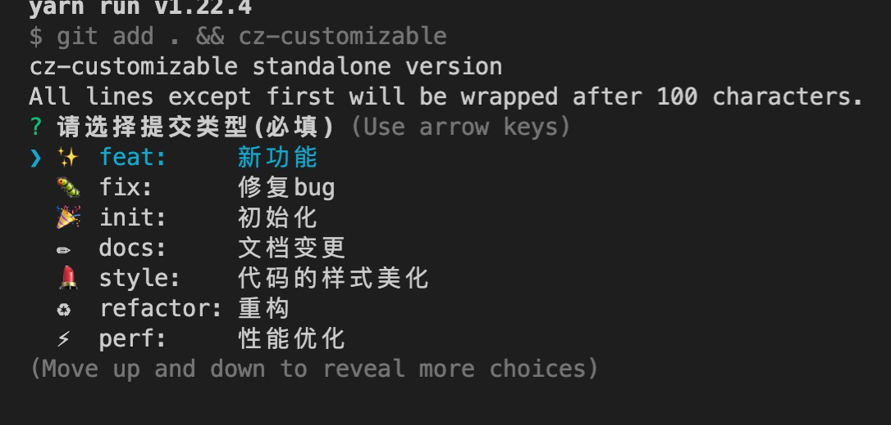

# Vue3 + TypeScript Cli 模板

手把手从 0 到 1 构建一个 Vue3 的模板

## 1.创建基础项目及配置

- 1.  创建项目

```
vue ui
```


- 2. 功能相关


- 3. 配置相关



## 2. 代码管理

- 1. 初始化本地仓库

  可以下载 Gitkraken,init 找到本地仓库,进行 git 初始化

- 2. 上传远程
     点击 Remote 右侧的+号,上传到远程 github

  
  

  现在最基础的 v-cli 模板就在你的 github 上啦!

## 3.添加相关插件和配置

### 初始依赖

  

### 代码规范相关

  #### 1. 代码格式规范(eslint + prettier)
  + 当我们使用v-cli模板时,选择了eslint+ prettier的模式,所以在eslintrc.js中会扩展以下几种依赖
  ```
   extends: [
    'plugin:vue/vue3-essential',
    'eslint:recommended',
    '@vue/typescript/recommended',
    '@vue/prettier/@typescript-eslint',
    '@vue/prettier',
  ],
  ```
  + 之后创建 .prettierrc.js
  ```
  module.exports = {
    printWidth: 80, //单行长度
    tabWidth: 2, //缩进长度
    useTabs: false, //使用空格代替tab缩进
    semi: false, //句末使用分号
    singleQuote: true, //使用单引号
    quoteProps: 'as-needed', //仅在必需时为对象的key添加引号
    jsxSingleQuote: true, // jsx中使用单引号
    trailingComma: 'all', //多行时尽可能打印尾随逗号
    bracketSpacing: true, //在对象前后添加空格-eg: { foo: bar }
    jsxBracketSameLine: true, //多属性html标签的‘>’折行放置
    arrowParens: 'always', //单参数箭头函数参数周围使用圆括号-eg: (x) => x
    requirePragma: false, //无需顶部注释即可格式化
    insertPragma: false, //在已被preitter格式化的文件顶部加上标注
    proseWrap: 'preserve', //不知道怎么翻译
    htmlWhitespaceSensitivity: 'ignore', //对HTML全局空白不敏感
    vueIndentScriptAndStyle: false, //不对vue中的script及style标签缩进
    endOfLine: 'lf', //结束行形式
    embeddedLanguageFormatting: 'auto', //对引用代码进行格式化
  }
  ```

  + 创建.prettierignore
  ```
    # Ignore artifacts:
    build
    coverage

    # Ignore all HTML files:
    *.html
  ```

  + 这时候一般来说会出现eslint和prettier的冲突,所以我们需要安装插件
  ```
  yarn add -D eslint-config-prettier
  ```
  然后在.eslintrc.js的extends中添加
  ```
  'plugin:prettier/recommended',

  ```
  + 格式化文档
    +  格式化所有文档: yarn prettier --write .
    +  格式化指定文档: yarn prettier --write index.js
    +  检查是否格式化文档: yarn prettier --check .
#### 2. 代码提交规范(cz-customizable+commitlint+husky+conventional-changelog)
  + 书写commit
    + cz-customizable(可自定义的 Commitizen 插件,可帮助实现一致的提交消息)
    + 安装
  
      ```
      yarn add cz-customizable -D
      ```
    + 配置
      + 在根目录下配置.cz-config.js
      + 添加代码

        ```
        module.exports = {
          types: [
            {
              value: ':sparkles: feat',
              name: '✨ feat:     新功能'
            },
            {
              value: ':bug: fix',
              name: '🐛 fix:      修复bug'
            },
            {
              value: ':tada: init',
              name: '🎉 init:     初始化'
            },
            {
              value: ':pencil2: docs',
              name: '✏️  docs:     文档变更'
            },
            {
              value: ':lipstick: style',
              name: '💄 style:    代码的样式美化'
            },
            {
              value: ':recycle: refactor',
              name: '♻️  refactor: 重构'
            },
            {
              value: ':zap: perf',
              name: '⚡️ perf:     性能优化'
            },
            {
              value: ':white_check_mark: test',
              name: '✅ test:     测试'
            },
            {
              value: ':rewind: revert',
              name: '⏪️ revert:   回退'
            },
            {
              value: ':package: build',
              name: '📦️ build:    打包'
            },
            {
              value: ':rocket: chore',
              name: '🚀 chore:    构建/工程依赖/工具'
            },
            {
              value: ':construction_worker: ci',
              name: '👷 ci:       CI related changes'
            }
          ],
          messages: {
            type: '请选择提交类型(必填)',
            customScope: '请输入文件修改范围(可选)',
            subject: '请简要描述提交(必填)',
            body: '请输入详细描述(可选)',
            breaking: '列出任何BREAKING CHANGES(可选)',
            footer: '请输入要关闭的issue(可选)',
            confirmCommit: '确定提交此说明吗？'
          },
          allowCustomScopes: true,
          allowBreakingChanges: [':sparkles: feat', ':bug: fix'],
          subjectLimit: 72
        }

        ```

      + 在package.json中添加脚本

        ```
        "scripts" : {
          "ct": "git add . && cz-customizable"
        }
        ```
      + 这时候当你执行yarn run ct时会显示如下图
      
        

  + 校验commit
      + commitlint
        + 检查 commit 是否符合某种规范的校验工具
        + 安装

        ```
        yarn add @commitlint/cli commitlint-config-git-commit-emoji commitlint-config-cz -D
        ```
        + 配置
          + 根目录创建commitlint.config.js
          + 添加代码

          ```
          module.exports = {
            extends: ['git-commit-emoji', 'cz']
          }
          ```
      + husky
        + 针对 git 流程自动执行 commitlint
        + 安装

          ```
          yarn add husky -D
          ```
        + 配置

            ```
            npm set-script prepare "husky install"
            npm run prepare
            npx husky add .husky/commit-msg 'npx --no-install commitlint --edit "$1"'
            ```
  + 生成日志
    + conventional-changelog
      + 可以根据项目的 commit 和 metadata 信息自动生成 changelogs 和 release notes 的系列工具
    + 安装
      + yarn add conventional-changelog-cli conventional-changelog-gitmoji-config -D
    + 配置
  
      在package.json中添加次脚本

      ```
      "scripts" : {
        ...
          "changelog": "conventional-changelog -p gitmoji-config -i CHANGELOG.md -s"
        }
      ```
    + 运行 yarn run changelog


## 3.layout 层 ☑️

### 3.1 空 ☑️

### 3.2 导航层

## 4.lib 层

### 4.1 axios 的封装

### 4.2 国际化

### 4.3 插件

## 5.router 层 ☑️

## 6. store 层

## 7. types 声明

## 8.utils 层

## 9.views 业务层

## 10.micro-service 层

### 1.使用 vue-cli 创建 TS 项目
